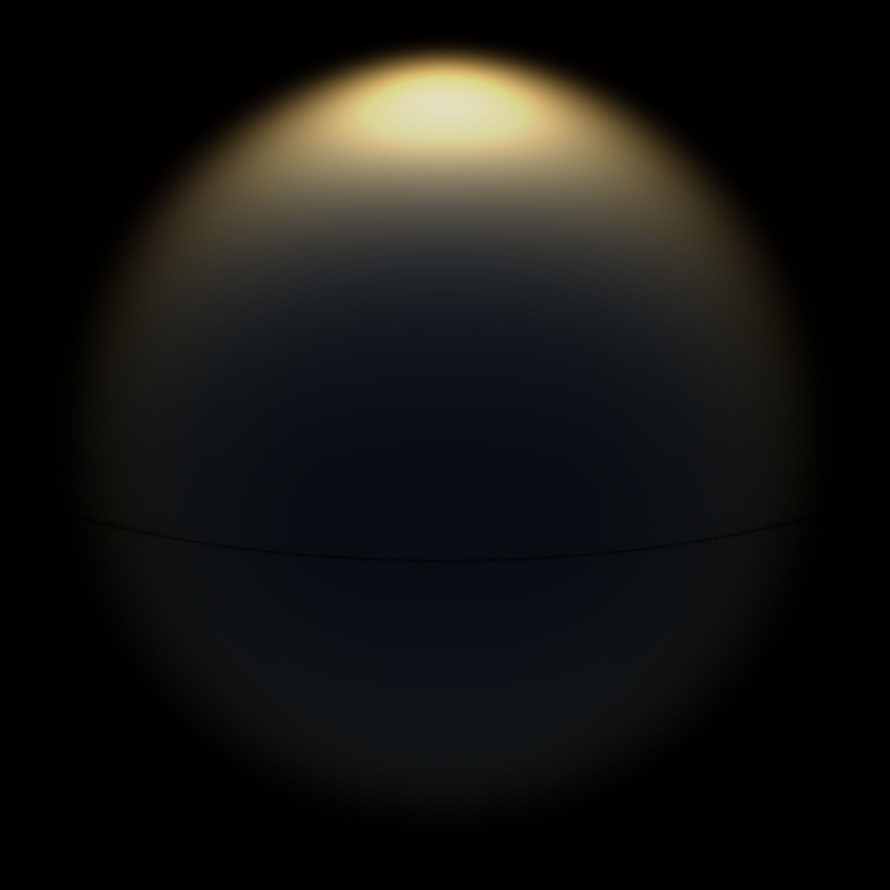

# Dieselsky
>Physical based sky rendering in go

>This package allows you to create atmospheric renders into a disk in JPG format using GO!

## Installation

```
cd <project_dir>/gosky
go build
./gosky [options] <height> <width> <clamped> <prefix>
```

For example

```
./gosky 4096 4096 true dome
```



> *Note: Atmosphere package assumes to be working
in meters to include all physical phenomena including wavelengths astronomical measurements*

Coefficients are based off of the surface layer coefficients for Rayleigh and
Mie scattering phenomena future work can be done to move non normalized images
into an HDR format for Global Environmental lights.

We can also extend the framework for atmosphere into a more generalized Rayleigh/Mie
Scatter framework to allow for different Mie Scattering solutions during weather
environmental changes and descriptions

This framework in the future should be updated to incorporate a handler for
Electron Node dispatch requests

Include options for detailed Rayleight / Mie Scatter and height configurations for complete control over the model for users to include all configurable options

**API Usage**

> Create a new atmosphere object and create textures
```
mSky := NewAtmosphere(45.0, 0.0)
mSky.SetDay(200.2)
base := "sky_"
for i := 0; i < 10; i++ {
  filename := base + strconv.FormatInt(int64(i), 10) + ".png"
  mSky.StepDay(1 + float32(i)/10)
  mSky.CreateTexture(256, 256, filename)
}
```

**Notes**
- Next update will fix the celestial observer model. 
- Fixed Mie Scattering Error where sun disk failed to render
- Adjust Sky.Light.Lx.Flux settings for sun intensity. Default (20.5)
- Adjust Mie Scattering Phase Function by tuning g variable, forward scatter coefficient
- BetaR , BetaM correspond to the extinction coefficients in RGB tristimulus color space. Tune these vectors according to atmopsheric composition to affect atmospheric colors

**Fixes**
- Eliminate Negative View Vector Evaluations
- Faciliate Parameter Tuning for the Atmosphere Package as a whole with JSON Configurations
- Approximate depth integrals for Rayleigh Mie scattering with Pre-Packaged LUTs for algorithmic speedup
- Implement Volumetric Cloud Features
- Implement Ozone Extinction


**Table of Measurements**
| phenomena | description | units | underlying units |
| ----------| ----------- | ------| -----------------|
| Flux      | Radiant Flux| Watts | kg m^2 s^-3      |
| Wavelength| Electromagnetic Wavelength| Meters | m |
| Astronomical Units| Radii| Meters | m |

